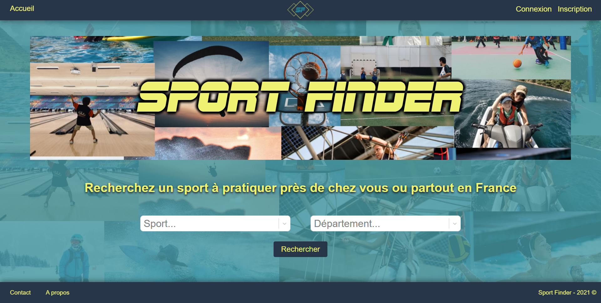

# Sport-Finder

## Table of contents

* What is Sport-Finder ?
* How does it work ?
* Stack

### What is Sport-Finder ?

Sport-Finder is a search tool to find a sport near your home or everywhere in France.

### How does it work ?

When you're on home page, enter the searched sport and your department and then, click on search button.

All results appears in a new page with a list on the left side and a map on the right side.

Chose your association by clicking on the association title and you'll be redirected on a page wich contains association's informations and user's reviews.

You can create an account and then connect you to post, update or delete your review.

You can contact us on contact page and if you want to know who we are, visit about page.

Enjoy your search

### Stack

#### Front

#### Back

#### API

